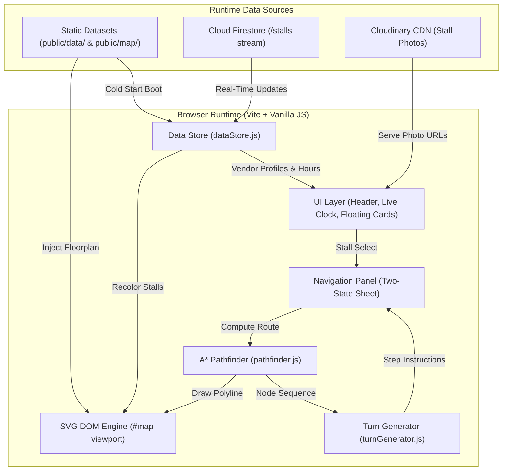

<p align="center">
  
</p>

<h1 align="center">MerkadoGo Web</h1>

<p align="center">
  <strong>High-performance, browser-native indoor kiosk map and multilingual vendor search directory for the Ligao City Public Market (Albay, Philippines).</strong>
</p>

<p align="center">
  
  
  
  
  
</p>

<p align="center">
  <a href="#overview">Overview</a> •
  <a href="#key-features">Key Features</a> •
  <a href="#system-architecture">System Architecture</a> •
  <a href="#tech-stack">Tech Stack</a> •
  <a href="#project-structure">Project Structure</a> •
  <a href="#getting-started">Getting Started</a> •
  <a href="#roadmap">Roadmap</a>
</p>

---

## Overview

**MerkadoGo Web** is a lightweight, zero-overhead web application engineered for public market touchscreen kiosks and mobile browsers. It empowers shoppers, visitors, and vendors to navigate the concrete labyrinth of the Ligao City Public Market with pinpoint precision—completely independent of external GPS signals.

By utilizing an inline DOM SVG rendering architecture, an in-memory A* pathway graph, and a real-time Cloud Firestore synchronization layer, MerkadoGo Web delivers instant interactivity, turn-by-turn pedestrian routing from 14 physical street entrances, and local multilingual discovery across English, Tagalog, and Central Bicolano.

> [!NOTE]
> MerkadoGo Web is a dedicated public-facing shopping and kiosk surface. Administrative tools, vendor management portals, and AI assistance modules operate exclusively within the companion Android mobile platform.

---

## Key Features

- **Interactive Vector Floorplan**: Full pan, pinch-to-zoom, and responsive hit-testing across all 231 vendor stalls and vacant slots with sub-millisecond selection feedback.
- **Pedestrian A\* Wayfinding**: Graph-based indoor pathfinding calculating optimal walking routes from 14 street entrance gates directly to any destination stall.
- **Corridor-Calibrated Animated Routing**: Route lines follow physical market aisles with zero stall clipping, smoothly tracing with a progressive SVG stroke animation (`1.2s` cubic ease-out).
- **Two-State Navigation Sheet**: Non-intrusive wayfinding interface featuring a compact minimized guidance bar (`#nav-minimized-bar`) and an expandable step-by-step direction sheet, with dynamic floating map control lifting for continuous route inspection.
- **Enhanced Stall Cards & CDN Photography**: Floating vendor profile cards rendering Cloudinary CDN stall photos, dynamic operating hours with live `Open Now` / `Closed` badges, and a "How Do I Get Here?" navigation action.
- **18-Zone Collapsible Filter & Vector Icons**: Quick-filtering dropdown supporting multi-category selection paired with custom SVG line vector icons for all market sections.
- **Multilingual Search Engine**: Normalized keyword search index supporting colloquial terms in English, Tagalog, and Central Bicolano (e.g., *sardines*, *gulay*, *karne*, *sari-sari*).
- **Civic Craft & Flat Utility UI**: Built with zero gradients, zero drop shadows, and 1px hairline borders (`#E2E8E2`) conforming to high-contrast civic accessibility standards.
- **Offline-Resilient Dual Data Layer**: Immediate first-paint initialization from bundled static JSON datasets with automatic background hydration from live Cloud Firestore `/stalls` streams.

---

## System Architecture



### 1. Vector Map Engine (`src/mapRenderer.js`, `src/mapControls.js`)
- Injects the master vector floorplan (`public/map/LigaoCity_PublicMarket_Map.svg`) directly into the DOM tree.
- Manages smooth CSS transform matrix panning, pinch zooming, and coordinate recentering.
- Isolates decorative vector export layers (`pointer-events: none`) to ensure 100% reliable delegated hit-testing on interactive stall polygons.
- Connects route polylines from corridor snap nodes straight into the destination stall geometric center via `getStallCenter()`.

### 2. A* Pathfinding & Wayfinding Engine (`src/pathfinder.js`, `src/turnGenerator.js`)
- Transforms the pathway node dataset (`map_nodes.json`) into an in-memory bidirectional weighted graph with Euclidean edge costs.
- Calculates deterministic, optimal paths using a binary min-heap A* search with monotonic tie-breaking.
- **Vector Node Calibration**: Translates node-space coordinates to the SVG canvas space via the mathematically verified center offset:
  $$\text{SVG}_x = \text{Node}_x + 7823.47, \quad \text{SVG}_y = \text{Node}_y + 3174.0$$
- **Angle-Only Navigation Invariant**: Because indoor concrete markets lack physical metric telemetry, navigation strictly calculates bearing deltas ($\Delta\theta$) between path segments, generating natural directional steps (*Straight*, *Turn Left*, *Turn Right*) with zero uncalibrated metric guesses.

### 3. Dual-Layer Data Sync (`src/dataStore.js`, `src/services/stallSync.js`)
- **Cold Boot**: Fetches and parses bundled static assets (`vendor_notes.json`, `map_nodes.json`, `stall_nodes.json`, `market_entry_points.json`, `subcategory_search_directory.json`) in parallel.
- **Live Stream**: Subscribes to `collection(db, "stalls")` via Firebase Firestore `onSnapshot`. Real-time stall document changes automatically reconcile SVG polygon fills, operating hours, and photo galleries without a page reload.
- **Resilient Fallback**: If network connectivity drops or security permissions block the stream, the application gracefully logs a warning and maintains full operational kiosk functionality using static fallback data.

### 4. Canonical 18-Zone Color System (`src/theme/colors.js`)
- Stalls are colored strictly based on their normalized `primary_category` using the official 18-Zone Palette.
- Zone 3 is officially categorized as **"Mixed Meat"** (`#C2185B`).
- Unassigned or vacant stalls adhere to the neutral Civic Craft palette (`#E2E8F0` fill with `#94A3B8` outline).

---

## Tech Stack

| Layer | Technology | Rationale |
|---|---|---|
| **Build & Dev Tooling** | [Vite 6.x](https://vitejs.dev/) | Instant HMR, native ES module compilation, optimized production bundling. |
| **Frontend Core** | Vanilla HTML5 & JavaScript (ES2022+) | Zero framework overhead, minimal memory footprint, maximum responsiveness on public kiosk hardware. |
| **Styling & Design System** | Vanilla CSS3 (Civic Craft Tokens) | CSS custom properties, 4px geometric layout grid, 0 gradients, 0 drop shadows, 1px hairline borders (`#E2E8E2`), responsive `100dvh` viewport sizing. |
| **Map Rendering Engine** | Inline DOM SVG | Native DOM event delegation, CSS-driven pan/zoom, dynamic polygon recoloring without `<canvas>` rasterization overhead. |
| **Indoor Routing** | Pure JavaScript A\* Algorithm | In-memory graph search with Euclidean heuristics and binary min-heap priority queue. |
| **Data Synchronization** | Firebase Cloud Firestore | Real-time reactive stream for vendor profile, status, and operating hour updates. |
| **Media Delivery** | Cloudinary CDN | High-performance image transformation and CDN delivery for vendor storefront photography. |

---

## Project Structure

```text
MerkadoGO Map/
├── database_schema/            # Official Firestore database models, rules, and constants
│   ├── constants/             # Market categories, section enumerations, and visual tokens
│   ├── firebase/              # Cloud Firestore security rules (public read for /stalls)
│   ├── models/                # Defensive data models and normalizers
│   └── typescript_types/      # TypeScript interface definitions (StallDocument, etc.)
├── public/                    # Production static runtime assets
│   ├── assets/                # Logos, badges, and kiosk icons
│   ├── data/                  # Static spatial graphs, vendor fallback, and search directory
│   │   ├── map_nodes.json
│   │   ├── market_entry_points.json
│   │   ├── stall_nodes.json
│   │   ├── subcategory_search_directory.json
│   │   └── vendor_notes.json
│   └── map/                   # Master Ligao City Public Market vector SVG floorplan
├── src/                       # Frontend application source code
│   ├── services/              # Live Firestore sync and stall data normalizer
│   │   ├── stallNormalizer.js
│   │   └── stallSync.js
│   ├── theme/                 # Design tokens, 18-zone palette, and SVG vector icons
│   │   ├── categoryIcons.js
│   │   └── colors.js
│   ├── dataStore.js           # Static data loading and in-memory store management
│   ├── main.js                # App bootstrap, lifecycle initialization, and event wiring
│   ├── mapControls.js         # CSS matrix pan, zoom, and recenter gesture controller
│   ├── mapRenderer.js         # SVG injection, hit-testing, and animated route drawing
│   ├── pathfinder.js          # Pure A* graph construction and shortest-path search
│   ├── style.css              # Civic Craft design system and component styles
│   ├── turnGenerator.js       # Bearing delta calculations and natural language turns
│   └── uiController.js        # Floating cards, two-state navigation sheet, and search UI
├── tasks/                     # Persistent task breakdown, verification, and progress logs
│   ├── findings.md            # Mathematical discoveries and coordinate calibration records
│   ├── progress.md            # Timestamped session logs
│   ├── task_plan.md           # Milestone roadmap and phase statuses
│   └── todo.md                # Atomic task tracker with acceptance criteria
├── .env.example               # Environment variables template
├── index.html                 # Main application HTML shell and kiosk overlay elements
├── package.json               # Project dependencies and build scripts
└── vite.config.js             # Vite configuration
```

---

## Getting Started

### Prerequisites
- **Node.js**: v18.0.0 or higher
- **npm**: v9.0.0 or higher

### Installation

1. Clone the repository:
   ```bash
   git clone https://github.com/KuraiKutsuki/MerkadoGo-WebApp.git
   cd MerkadoGo-WebApp
   ```

2. Install dependencies:
   ```bash
   npm install
   ```

3. Configure environment variables:
   Copy the example environment configuration:
   ```bash
   cp .env.example .env
   ```
   Provide your Firebase Web Client and Cloudinary credentials in `.env`:
   ```ini
   VITE_FIREBASE_API_KEY=your_firebase_api_key
   VITE_FIREBASE_AUTH_DOMAIN=merkado-go.firebaseapp.com
   VITE_FIREBASE_PROJECT_ID=merkado-go
   VITE_FIREBASE_STORAGE_BUCKET=merkado-go.firebasestorage.app
   VITE_FIREBASE_MESSAGING_SENDER_ID=your_sender_id
   VITE_FIREBASE_APP_ID=your_app_id
   VITE_FIREBASE_MEASUREMENT_ID=your_measurement_id

   VITE_CLOUDINARY_CLOUD_NAME=diiuzmjnk
   VITE_CLOUDINARY_UPLOAD_PRESET=merkadogo
   ```

### Development

Start the local development server:
```bash
npm run dev
```
Open your browser and navigate to `http://localhost:5173`.

### Production Build

Compile and bundle the production distribution:
```bash
npm run build
```
Preview the production build locally:
```bash
npm run preview
```

---

## Roadmap

Development is structured into five distinct phases:

- [x] **Phase 1: Foundation (Vite + Shell)** — Design tokens, Civic Craft CSS variables, and layout shells.
- [x] **Phase 2: Map Rendering & Interactivity** — SVG DOM injection, pan/zoom controls, and delegated hit-testing.
- [x] **Phase 3: Data Integration** — Static JSON asset loaders, canonical 18-zone coloring, and real-time Firestore synchronization.
- [x] **Phase 4: Navigation Engine** — Euclidean A* routing, angular turn generation, route UI overlay, and pathway vector calibration.
- [/] **Phase 4 Extension: Wayfinding & UI Refinements** *(Active)*
  - [x] Task 4.4: Exact pathway vector calibration (`7823.47, 3174.0`) and animated route tracing.
  - [x] Task 4.5: Enhanced stall detail card with Cloudinary photography and dynamic operating hours badge.
  - [x] Wayfinding Polish: Two-State Navigation Sheet, lifted map controls, destination stall center route snapping, 18-zone collapsible filter panel, vector SVG icons, and live civic clock.
  - [ ] Task 4.6: Demand-Driven Entrance Markers & Entrance Preview Popup.
- [ ] **Phase 5: Multilingual Search & Directory** — Keyword tokenizer, Bicolano/Tagalog search directory mapping, and search-to-map interaction.
